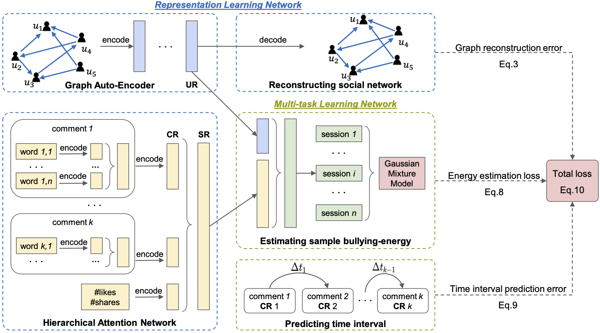

# UCD - Unsupervised Cyberbullying Detection 

Implementation of <ins>U</ins>nsupervised <ins>C</ins>yberbullying <ins>D</ins>etection via Time-Informed Gaussian Mixture Model (UCD) [1].

The UCD framework consists of two major components:
(1) a representation learning network that leverages HAN and GAE to obtain multi-modal representations,
and (2) a multi-task learning network that jointly optimizes a GMM-based energy estimation task to predict cyberbullying instances and a temporal prediction task to further refine the session representations with the comment inter-arrival times.

## Code usage
1. Run the data pre-processing script [preprocess.py](/data/preprocess.py).
See more details in the [data README](/data/README.md).
2. Run the main program [run_ucd.py](run_ucd.py).
The output is the averaged Precision, Recall, F1, AUC, and the corresponding standard deviations over 10 replications for the Instagram dataset.

### Python packages version
* python == 2.7
* tensorflow == 1.12.0
* keras == 2.2.4
* networkx == 2.2
* numpy == 1.16.5
* pandas == 0.24.2

### Reference
> \[1\] [Lu Cheng](http://www.public.asu.edu/~lcheng35/), [Kai Shu](http://www.cs.iit.edu/~kshu/), [Siqi Wu](https://avalanchesiqi.github.io/), [Yasin N. Silva](http://www.public.asu.edu/~ynsilva/), [Deborah L. Hall](http://www.dhallpsych.com/index), and [Huan Liu](http://www.public.asu.edu/~huanliu/). Unsupervised Cyberbullying Detection via Time-Informed Gaussian Mixture Model. *ACM Conference on Information and Knowledge Management (CIKM)*, 2020. \[[paper](https://arxiv.org/abs/2008.02642)\]
